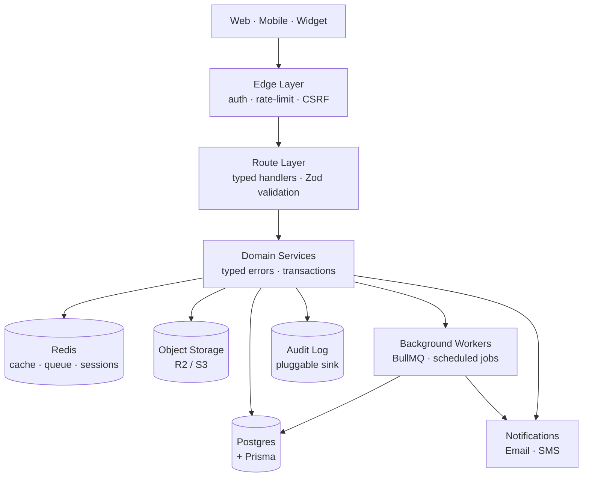

# Hi, I'm Siam

Self-taught full-stack developer + IT graduate (Networking & Security), pivoting into software engineering through ambitious solo projects. Sydney, NSW (relocating to Hobart, TAS — June 2026).

I work across product, engineering, and DevOps end-to-end on personal projects, learning the modern web stack by building real things from scratch.

---

## Currently Building

**Deshi Drip** — a centralised streetwear marketplace concept for Bangladesh. Aiming to be the *Culture Kings of BD*. My first major coding project, started October 2025. The first iteration collapsed under untested rapid feature work (2000+ errors after three weeks of feature-rushing without tests or build gates) — I made the call to discard and restart from scratch with discipline. The current build: 158-model Postgres schema across 18 domain files, custom multi-portal auth (4 user groups, per-portal JWT, WebAuthn, argon2id), modular monolith on pnpm + Turborepo with adapter patterns for storage / email / SMS / payments / courier. The architectural maturation is sequenced across multiple phases.

**feebaq** — a multi-tenant SaaS concept for ecommerce merchants. Demo store currently live. Multi-tenant Organization-root design, pluggable provider architecture, clean separation between merchant data and platform code.

**A third project** — an ecosystem play I'm prototyping privately. More when it's ready to share.

> All three are personal/portfolio work — not commercial revenue-generating businesses (yet).

---

## Tech Stack

*Background from university (Networking & Security major):*

I lean toward: modular monoliths over microservices, adapter patterns for anything pluggable, schema-first design, decimal arithmetic for money, strict typing with no escape hatches, and writing the architecture decision before writing the code.

---

## How I Work

- Opinionated about quality — earned the hard way. No corner-cutting, no skipping tests, no "we'll fix it post-launch." (My first iteration of Deshi Drip taught me this lesson by collapsing.)
- Heavy investment in `.context/` docs + decision logs — if a system is worth building, it's worth being legible 6 months later. [→ sample decision log](https://gist.github.com/ra-siam/6fee429973313c4b27a7b32298f5e417)
- Comfortable owning the entire pipeline: product spec → schema → backend → frontend → infra → deploy.

---

## How I Architect

A typical request through one of my platforms:

Common patterns across my work: typed error throws (services don't return error envelopes), strict module boundaries enforced at the dependency graph, adapter interfaces for any external provider (storage, email, SMS, payment gateway, courier), and a single primary database with serializable isolation for any financial operation.

---

## Where to Reach Me

- Email — [siamr4@gmail.com](mailto:siamr4@gmail.com)
- LinkedIn — [ra-siam](https://www.linkedin.com/in/ra-siam)
- GitHub — you're here

**Open to:** junior or entry-level software engineering / full-stack developer / web developer / IT roles in Australia (Sydney now, Hobart from June 2026 — on-site, hybrid, or remote). Graduate programs, internships, contract, or full-time. Also open to early technical co-founder conversations with the right partner.

Most of my code lives in private repos — happy to walk through architecture, decisions, and code in a 1:1 conversation.
